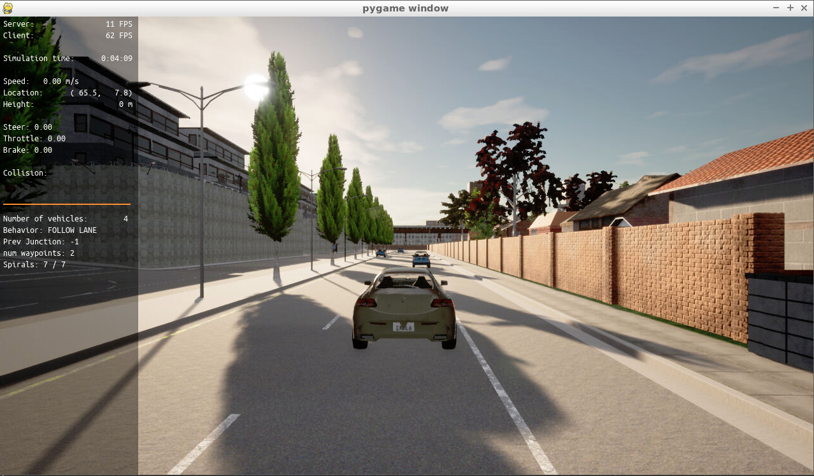
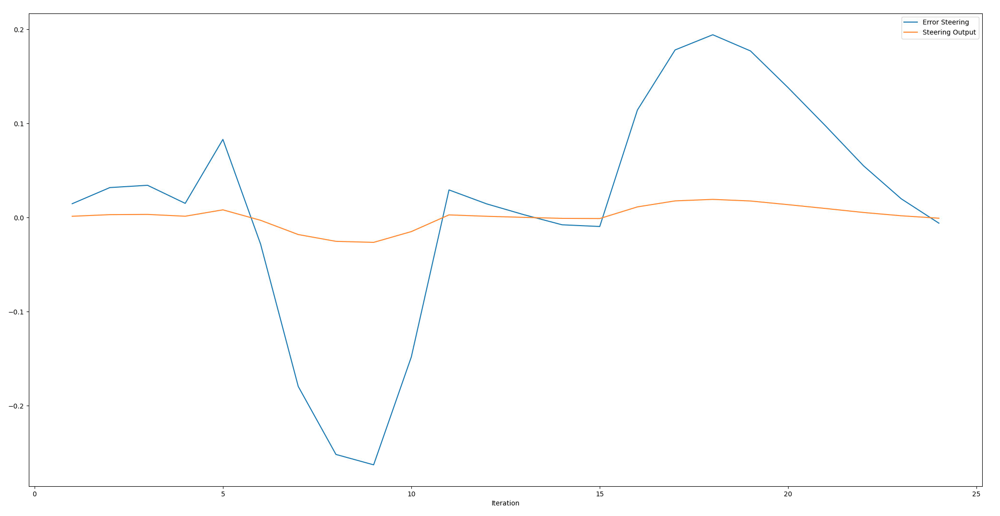
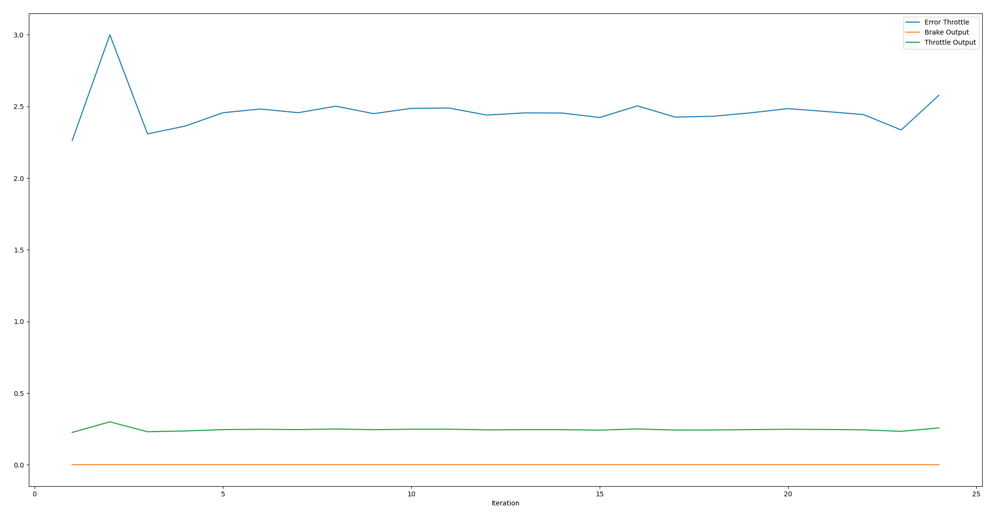
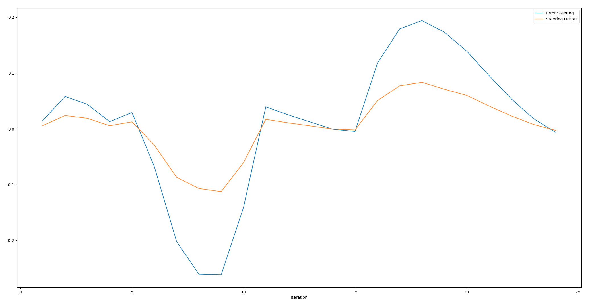
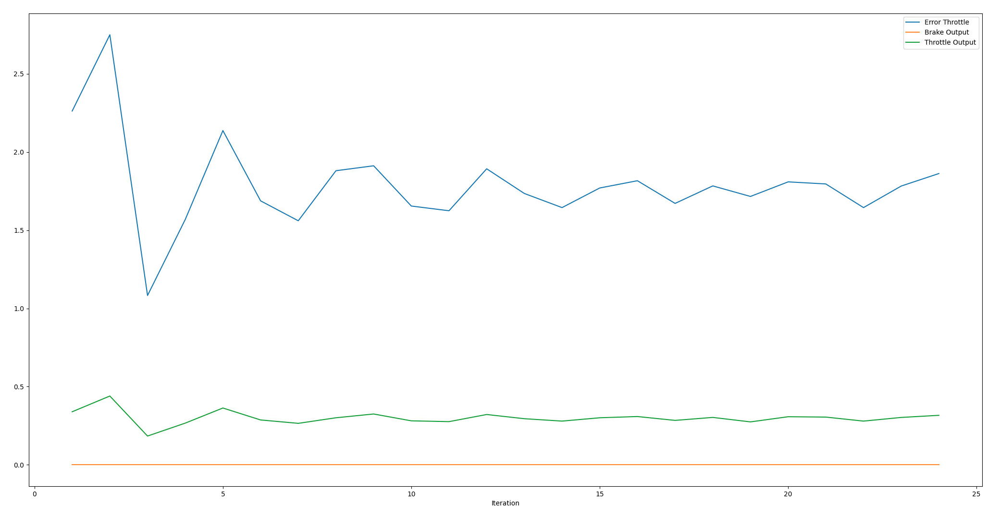
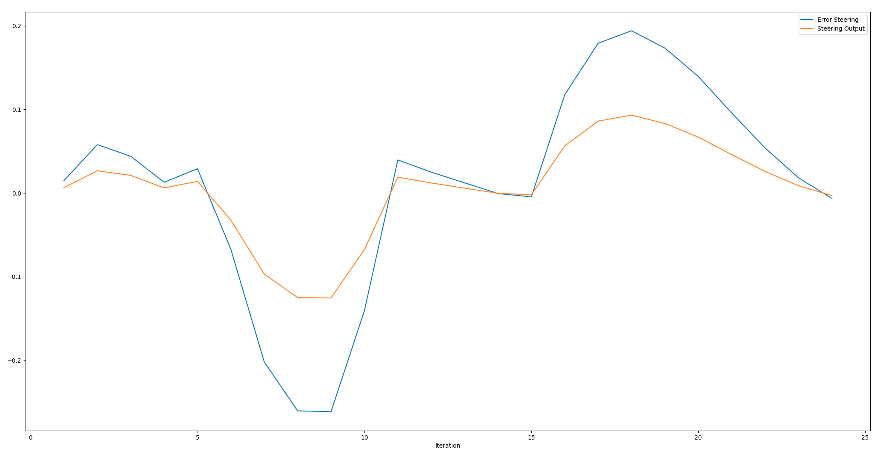
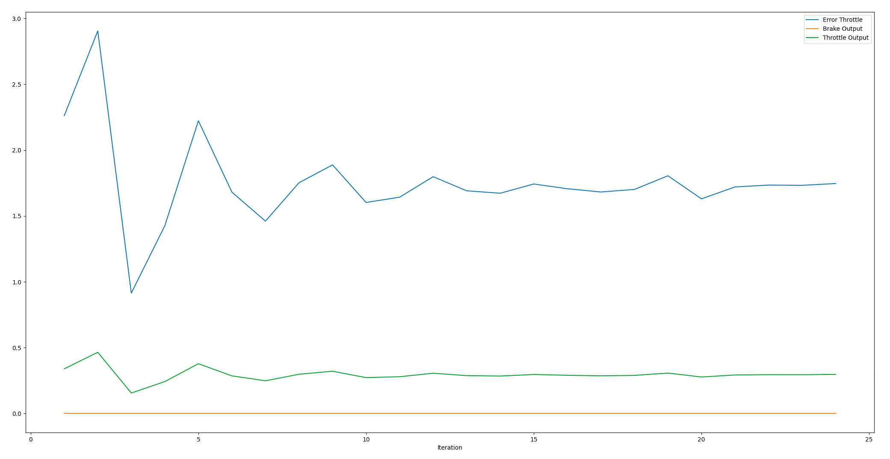
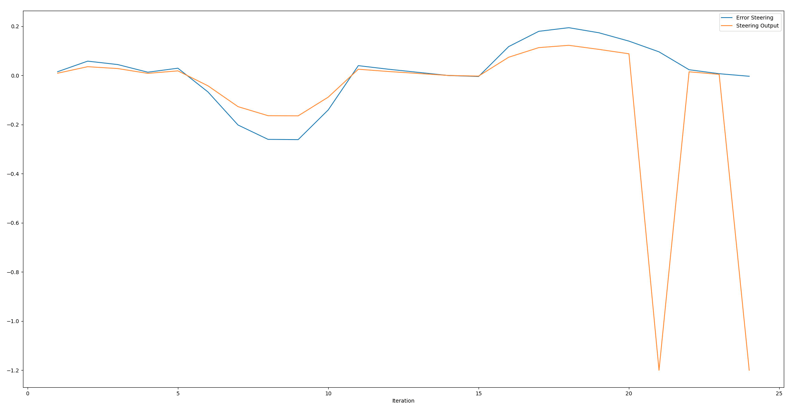
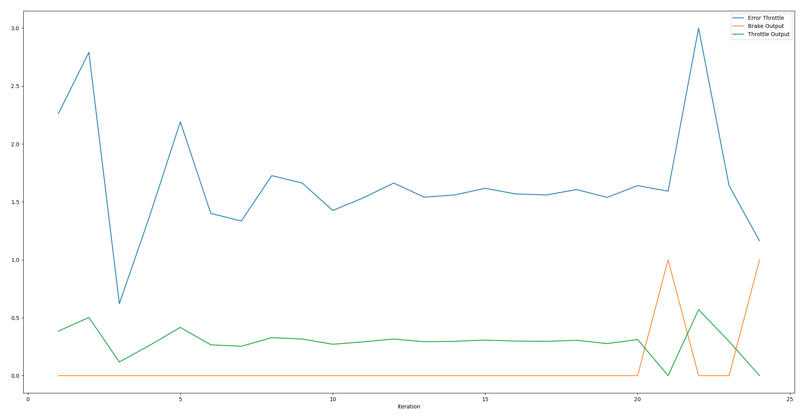

# Control and Trajectory Tracking for Autonomous Vehicle

# Proportional-Integral-Derivative (PID)

https://user-images.githubusercontent.com/98892946/163715951-1d50c665-e1ff-4179-b214-ab4208be10f9.mov

In this project, a PID controller is designed to perform vehicle trajectory tracking. Given a trajectory as an array of locations, and a simulation environment, tested its efficiency on the CARLA simulator used in the industry.

## Tests
|  TEST  | KP_STEER | KI_STEER | KD_STEER | KP_THROTTLE | KI_THROTTLE | KD_THROTTLE |
|:------:|:--------:|:--------:|:--------:|:-----------:|:-----------:|:-----------:|
| Test 1 |   0.1    |   0.0    |   0.0    |     0.1     |     0.0     |     0.0     |
| Test 2 |   0.45   |   0.02   |   0.25   |    0.18     |    0.01     |     0.1     |
| Test 3 |   0.5    |   0.02   |   0.3    |    0.18     |    0.01     |     0.1     |
| Test 4 |   0.65   |   0.02   |   0.3    |     0.2     |    0.01     |     0.1     |

### Test 1

### Test 2

### Test 3

### Test 4

## What is the effect of the PID according to the plots, how each part of the PID affects the control command?

- `P` ---> Proportional term: Produces an output value that is proportional to the current error value. A high proportional gain results in a large change in the output for a given change in the error.
- `I` ---> Integral term: Proportional to both the magnitude of the error and the duration of the error. The integral term accelerates the movement of the process towards setpoint and eliminates the residual steady-state error that occurs with a pure proportional controller.
- `D` ---> Derivative term: calculated by determining the slope of the error over time and multiplying this rate of change by the derivative gain. Derivative action predicts system behavior and thus improves settling time and stability of the system.

More detailed information: [PID controller](https://en.wikipedia.org/wiki/PID_controller#Proportional)

## How wouuld you design a way to automatically tune the PID parameters?

`Twiddle algorithm`:  he twiddle algorithm continuously tunes the PID controller's hyperparameters by analyzing the cross-track error and keeping track of the smallest CTE.

## PID controller is a model free controller, i.e. it does not use a model of the car. Could you explain the pros and cons of this type of controller?
PID can be used even a model is not available. It is a simple algorithm to implement and compute, because of that it suits to run on basic platforms.
Using single reference point in each step gives PID disadvantage to produce much better results.

# Instructions

## Run Carla Simulator

Open new window

* `su - student`

// Will say permission denied, ignore and continue

* `cd /opt/carla-simulator/`

* `SDL_VIDEODRIVER=offscreen ./CarlaUE4.sh -opengl`

## Compile and Run the Controller

Open new window

* `cd nd013-c6-control-starter/project`

* `./install-ubuntu.sh`

* `cd pid_controller/`

* `rm -rf rpclib`

* `git clone https://github.com/rpclib/rpclib.git`

* `cmake .`

* `make` (This last command compiles your c++ code, run it after every change in your code)

## Testing

To test your installation run the following commands.

* `cd nd013-c6-control-starter/project`

* `./run_main_pid.sh`

This will silently fail `ctrl + C` to stop

* `./run_main_pid.sh` (again)

Go to desktop mode to see CARLA

If error bind is already in use, or address already being used

* `ps -aux | grep carla`

* `kill id`

### Tips:

- When you wil be testing your C++ code, restart the Carla simulator to remove the former car from the simulation.

- If the simulation freezes on the desktop mode but is still running on the terminal, close the desktop and restart it.

- When you will be tuning the PID parameters, try between those values:
